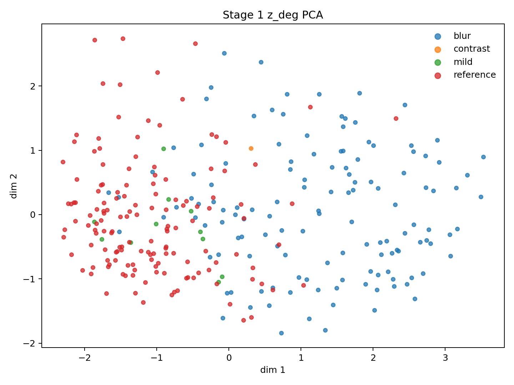
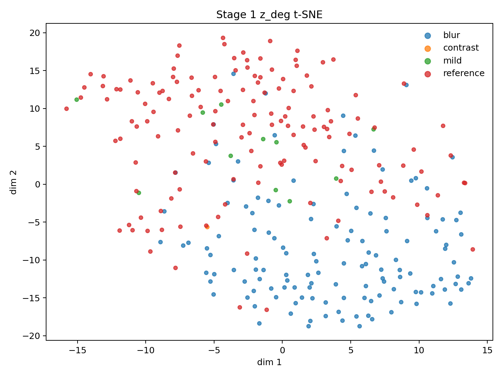
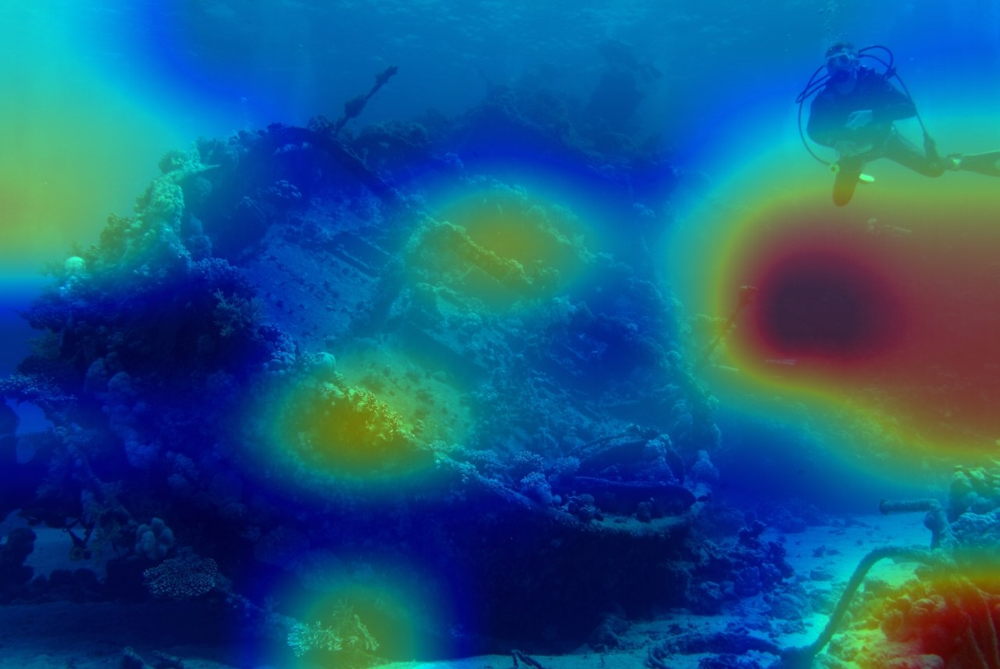
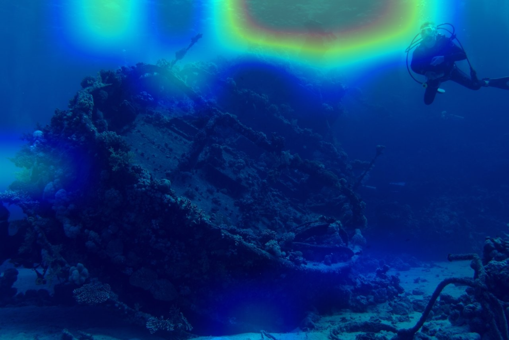

# Underwater Degradation-aware Token Experiment Report

## 1. 實驗目標

本實驗以 UIEB paired dataset 訓練一個 weakly-supervised underwater degradation assessor。模型不直接產生增強影像，而是從單張水下影像預測四個退化程度、一個整體品質分數，以及供後續 Stage 2 使用的 latent representation。

模型輸出：

| 輸出 | 意義 | Shape |
|---|---|---|
| `s_color` | 色偏程度，越高代表退化越嚴重 | `[B, 1]` |
| `s_blur` | 模糊程度，越高代表退化越嚴重 | `[B, 1]` |
| `s_contrast` | 低對比程度，越高代表退化越嚴重 | `[B, 1]` |
| `s_haze` | 霧化程度，越高代表退化越嚴重 | `[B, 1]` |
| `q_quality` | 整體品質，越高代表品質越好 | `[B, 1]` |
| `z_deg` | latent degradation representation | `[B, 128]` |
| `feature` | backbone global pooled feature | ResNet-50 `[B, 2048]`；ConvNeXt-Tiny `[B, 768]` |

## 2. Dataset 與 split

UIEB 共使用 890 組 raw/reference pairs。資料不實際搬移，而是由 `metadata/uieb_pseudo_labels.csv` 的 `split` 欄位控制：

| Split | Pairs | Images |
|---|---:|---:|
| Train | 619 | 1,238 |
| Validation | 126 | 252 |
| Test | 145 | 290 |

raw 與 reference 永遠位於相同 split。Pseudo-label normalization 的最小值與最大值只由 training split 擬合，再套用到 validation/test，避免使用 test 統計量。

## 3. Pseudo-label 定義

所有 target 都被限制在 `[0, 1]`。

- `s_color`：LAB mean chromatic shift 與 RGB channel imbalance 的組合，經 min-max normalization。
- `s_blur`：Laplacian variance 的反向 min-max normalization。
- `s_contrast`：Y channel standard deviation 的反向 min-max normalization。
- `s_haze`：

  \[
  s_{haze}=0.5s_{contrast}+0.3s_{low\_saturation}+0.2s_{flat\_brightness}
  \]

- `q_quality`：

  \[
  q_{quality}=0.5\,UIQM_{norm}+0.5\,UCIQE_{norm}
  \]

這些 target 是 weak pseudo-label，而非人工 MOS ground truth。因此結果主要表示模型擬合這套 degradation/quality proxy 的能力。

## 4. Model architecture

輸入圖片先 resize 到 `224×224`，再使用 ImageNet mean/std normalization。

```text
Image [B, 3, 224, 224]
          |
          v
ResNet-50 / ConvNeXt-Tiny
          |
          v
Global Average Pooling
          |
          v
feature [B, D]
     +----+----------------+
     |                     |
     v                     v
token_head              score_head
     |                     |
z_deg [B, 128]       scores [B, 5]
```

Score head 最後使用 sigmoid，因此五個輸出位於 `[0,1]`。`z_deg` 沒有 sigmoid 或 normalization。

### 重要限制：目前的 `z_deg`

目前 training loss 只使用 `scores`，沒有直接使用 `z_deg`。因此 `token_head` 沒有收到 gradient update；fine-tune 實驗的 backbone 會因 score loss 更新，但 `z_deg` 最後一段仍是固定的隨機 projection。

所以目前的 PCA/t-SNE 可以作為探索性分析，但不能當作「degradation token 已被完整訓練」的證據。下一版建議改成：

```text
feature -> z_deg -> score_head -> scores
```

或對 `z_deg` 增加 supervised contrastive、triplet、regression 或 reconstruction objective。

## 5. Training objective

每個 batch 同時輸入 raw 與 reference：

\[
L_{score} =
SmoothL1(\hat{s}_{raw},s_{raw})+
SmoothL1(\hat{s}_{ref},s_{ref})
\]

Quality ranking loss：

\[
L_{rank} =
\max(0,\;0.1-(\hat{q}_{ref}-\hat{q}_{raw}))
\]

總 loss：

\[
L=L_{score}+L_{rank}
\]

Best checkpoint 由 validation split 的平均五項 MAE 選擇。

## 6. 四組實驗設定

| Experiment | Backbone | Backbone update | LR | Epochs |
|---|---|---|---:|---:|
| `resnet50_frozen` | ResNet-50 | Frozen | 1e-4 | 20 |
| `resnet50_finetune` | ResNet-50 | Fine-tuned | 1e-5 | 20 |
| `convnext_tiny_frozen` | ConvNeXt-Tiny | Frozen | 1e-4 | 20 |
| `convnext_tiny_finetune` | ConvNeXt-Tiny | Fine-tuned | 1e-5 | 20 |

## 7. Test results

平均五項 MAE 定義：

\[
MAE_{5} =
\frac{
MAE_{color}+MAE_{blur}+MAE_{contrast}+MAE_{haze}+MAE_{quality}
}{5}
\]

| Model | Best epoch | Average 5-score MAE ↓ | Quality ranking ↑ | Mean quality margin |
|---|---:|---:|---:|---:|
| **ConvNeXt-Tiny fine-tune** | **19** | **0.056379** | **1.000000** | **0.197686** |
| ConvNeXt-Tiny frozen | 20 | 0.082538 | 0.979310 | 0.173861 |
| ResNet-50 frozen | 18 | 0.105130 | 0.572414 | 0.009269 |
| ResNet-50 fine-tune | 20 | 0.123855 | 0.365517 | -0.010080 |

### Per-score MAE

| Model | Color ↓ | Blur ↓ | Contrast ↓ | Haze ↓ | Quality ↓ |
|---|---:|---:|---:|---:|---:|
| **ConvNeXt-Tiny fine-tune** | **0.052219** | 0.046416 | **0.054919** | **0.042818** | 0.085525 |
| ConvNeXt-Tiny frozen | 0.090881 | **0.045982** | 0.098891 | 0.072371 | 0.104566 |
| ResNet-50 frozen | 0.142835 | 0.059281 | 0.147425 | 0.093870 | **0.082241** |
| ResNet-50 fine-tune | 0.141478 | 0.112036 | 0.154506 | 0.094521 | 0.116732 |

### Per-score Spearman correlation

| Model | Color ↑ | Blur ↑ | Contrast ↑ | Haze ↑ | Quality ↑ |
|---|---:|---:|---:|---:|---:|
| **ConvNeXt-Tiny fine-tune** | **0.877812** | **0.629410** | **0.922971** | **0.855196** | **0.645605** |
| ConvNeXt-Tiny frozen | 0.740226 | 0.513276 | 0.728496 | 0.605743 | 0.521532 |
| ResNet-50 frozen | 0.378660 | 0.031152 | 0.496449 | 0.392289 | 0.279167 |
| ResNet-50 fine-tune | 0.214502 | -0.272197 | 0.285377 | 0.226407 | -0.186059 |

## 8. Quality ranking

每個 test pair 都比較 predicted quality：

\[
margin_i=\hat{q}_{reference,i}-\hat{q}_{raw,i}
\]

若 `margin_i > 0`，該 pair 判斷正確：

\[
RankingAcc =
\frac{\#(\hat{q}_{reference}>\hat{q}_{raw})}{145}
\]

ConvNeXt-Tiny fine-tune 在 145 組 test pairs 全部排序正確。需要注意，該模型的 `q_quality R² = -0.128966`，表示它很擅長判斷 paired reference 是否優於 raw，但絕對 quality calibration 仍不理想。Ranking accuracy 與 regression accuracy 應分開解讀。

## 9. Feature visualization

四組模型皆已輸出 `z_deg` PCA 與 t-SNE：

- `results/<model>/vis/z_deg_pca.png`
- `results/<model>/vis/z_deg_tsne.png`

最佳模型：





圖中 raw 與 reference 已呈現一定程度分離，但 degradation group 並沒有形成清楚、完整的多類 cluster。此外，分組規則取前四項 target 的最大值；由於 `s_blur` 整體值偏高，多數 raw 被歸為 blur，造成類別分布不平衡。加上 token head 未直接訓練，這些圖目前只能支持「backbone feature 含有 raw/reference 差異」的弱結論。

## 10. Grad-CAM

使用最佳模型 `convnext_tiny_finetune`，輸入 `392_img_.png`，在最後一個 ConvNeXt depthwise convolution：

```text
backbone.stages.3.blocks.2.conv_dw
```

分別產生五個輸出的 Grad-CAM：

- `results/convnext_tiny_finetune/gradcam/392_s_color.png`
- `results/convnext_tiny_finetune/gradcam/392_s_blur.png`
- `results/convnext_tiny_finetune/gradcam/392_s_contrast.png`
- `results/convnext_tiny_finetune/gradcam/392_s_haze.png`
- `results/convnext_tiny_finetune/gradcam/392_q_quality.png`

Haze Grad-CAM：



Quality Grad-CAM：



目前 activation 偏向低解析度的大區域響應，適合觀察模型使用的全域區域，但不應解讀成精確 segmentation mask。後續應增加多張、不同退化類型影像，並比較 raw/reference Grad-CAM 的一致性。

## 11. 結論

1. ConvNeXt-Tiny 明顯優於 ResNet-50。
2. ConvNeXt-Tiny fine-tune 是目前最佳模型，平均五項 MAE 為 `0.056379`，paired quality ranking 為 `100%`。
3. ConvNeXt-Tiny frozen 已有很強 baseline，顯示 ImageNet feature 本身包含相當程度的水下退化資訊。
4. ResNet-50 fine-tune 在目前 learning rate、training objective 或 optimization setting 下表現不佳。
5. Quality ranking 很強，但 absolute quality regression 的 R² 仍為負值。
6. `z_deg` head 尚未直接受訓，接入 Stage 2 前應先修改 architecture/loss 並重新訓練。

## 12. Reproduction commands

重新評估四組 checkpoint：

```bash
DEVICE=mps ./scripts/evaluate_all_models.sh
```

重新產生四組 PCA/t-SNE 與最佳模型五種 Grad-CAM：

```bash
DEVICE=mps ./scripts/run_post_training_evaluation.sh
```

若環境沒有 MPS：

```bash
DEVICE=cpu NUM_WORKERS=0 ./scripts/evaluate_all_models.sh
DEVICE=cpu ./scripts/run_post_training_evaluation.sh
```
