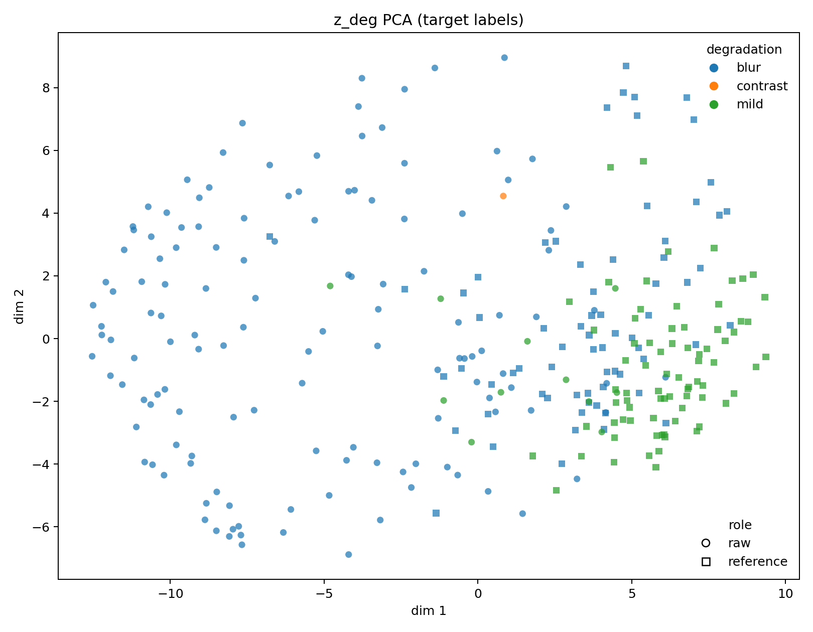
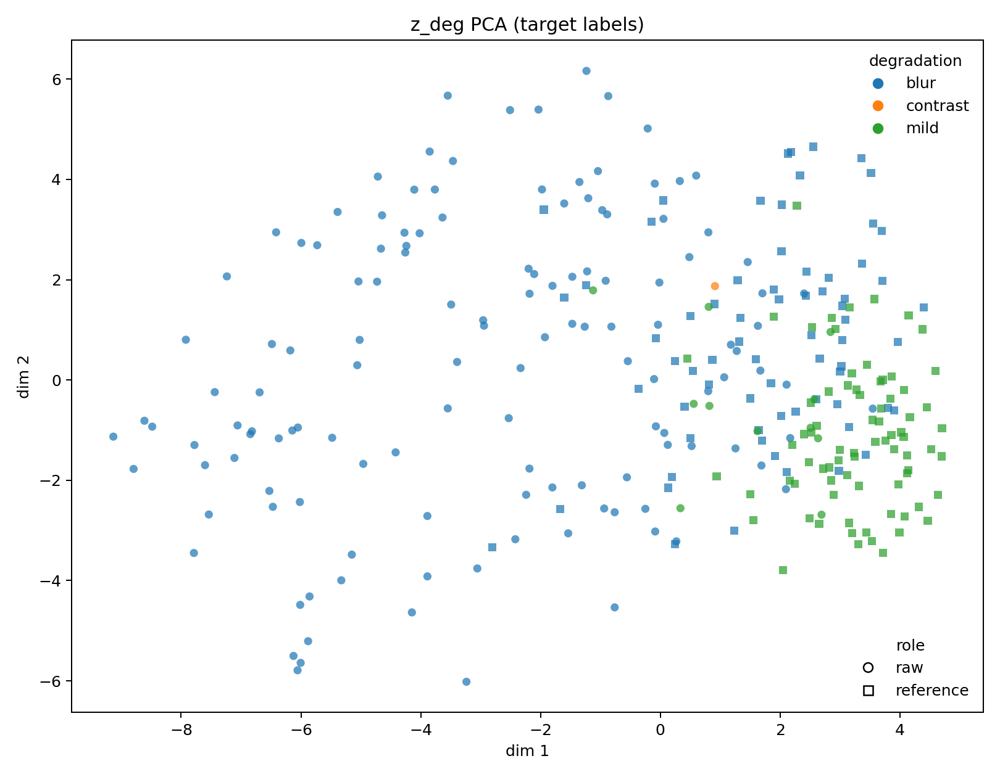
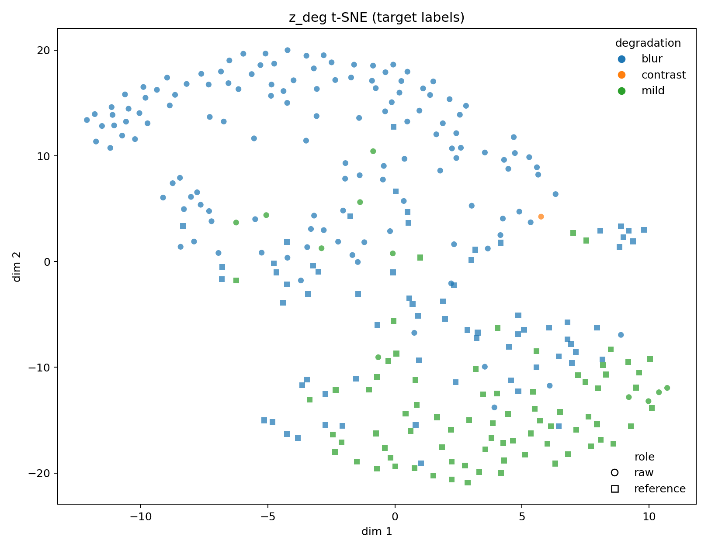
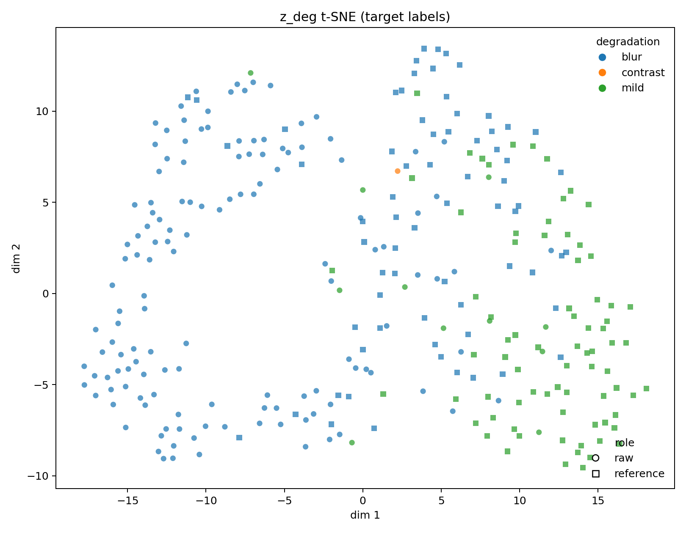
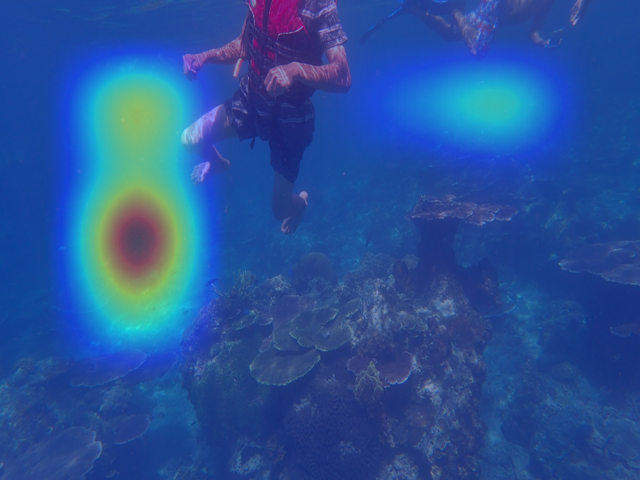
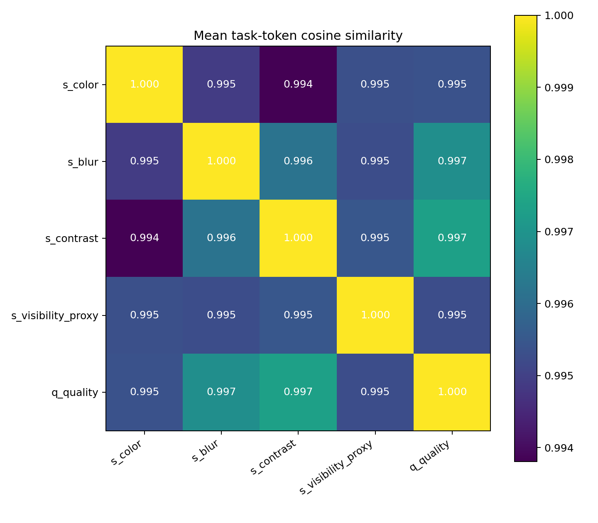
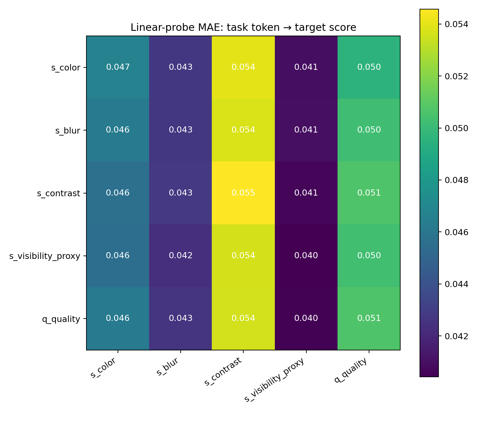

# Underwater Stage 1：完整實驗與 Evaluation Report

更新日期：2026-06-22

## 1. 研究目標

本研究使用 UIEB paired dataset 訓練 weakly-supervised underwater degradation assessor。Stage 1 不負責產生增強影像，而是從輸入影像估計退化與品質，並輸出可供後續 Stage 2 enhancement network 使用的 degradation representation。

模型的主要輸出為：

| 輸出 | 意義 | 數值方向 |
|---|---|---|
| `s_color` | 色偏程度 | 越高表示色偏越嚴重 |
| `s_blur` | 模糊程度 | 越高表示越模糊 |
| `s_contrast` | 低對比程度 | 越高表示對比退化越嚴重 |
| `s_visibility_proxy` | 弱能見度 proxy | 越高表示能見度越差 |
| `q_quality` | 整體品質 | 越高表示品質越好 |
| `z_deg` | 全域 degradation latent | `[B, 128]` |

因此，一張圖片通過完整 network 後，最終預測不是一組影像 feature maps，而是五個 scalar prediction，加上一個 128 維 latent representation。Backbone 中間仍會產生 spatial feature maps，Task-aware model 也會額外輸出 task tokens 與 attention maps，供分析或 Stage 2 conditioning 使用。

## 2. Dataset、split 與 supervision

UIEB 共使用 890 組 raw/reference pairs：

| Split | Pairs | Images |
|---|---:|---:|
| Train | 619 | 1,238 |
| Validation | 126 | 252 |
| Test | 145 | 290 |

raw 與對應 reference 永遠位於同一 split。Pseudo-label normalization 只使用 training split 的統計量，再套用到 validation/test，避免 test leakage。

所有 target 都是由影像統計指標建立的 weak pseudo-label，而不是人工 Mean Opinion Score：

- `s_color`：LAB chromatic shift 與 RGB channel imbalance。
- `s_blur`：Laplacian variance 的反向 normalization。
- `s_contrast`：亮度 channel 標準差的反向 normalization。
- `s_visibility_proxy`：低對比、低飽和與亮度平坦程度的組合。
- `q_quality`：normalized UIQM 與 UCIQE 的平均。

所以本報告中的 MAE、R² 與 correlation，表示模型擬合目前 pseudo-label 定義的能力，不應直接宣稱等同人類主觀品質評分。

## 3. 模型版本

### 3.1 V2 supervised degradation token

V2 修正了 V1 中 `z_deg` 不直接參與 score loss 的問題：

```text
image
  -> backbone
  -> global feature [B, D]
  -> token_head
  -> z_deg [B, 128]
  -> score_head + sigmoid
  -> scores [B, 5]
```

由於五個 scores 必須經過 `z_deg` 才能產生，score regression loss 會直接監督 degradation token。

### 3.2 Task-aware attention model

Task-aware model 保留 backbone spatial feature map，並加入五個 learnable task tokens：

```text
spatial feature map
  -> image tokens
  -> self-attention
  -> five task-token cross-attention queries
  -> five task-specific prediction heads
```

主要輸出：

| Output | Shape |
|---|---|
| `scores` | `[B, 5]` |
| `task_tokens` | `[B, 5, 128]` |
| `z_deg` | `[B, 128]`，五個 task tokens 的平均 |
| `attention_maps` | `[B, 5, 7, 7]` |
| `spatial_feature` | backbone spatial feature map |

## 4. Evaluation 指標

### Average 5-score MAE

\[
MAE_5 =
\frac{
MAE_{color}+MAE_{blur}+MAE_{contrast}+MAE_{visibility}+MAE_{quality}
}{5}
\]

數值越低越好，表示五個輸出平均而言越接近 pseudo-label。

### R²

\[
R^2 = 1-\frac{\sum_i(y_i-\hat{y}_i)^2}{\sum_i(y_i-\bar{y})^2}
\]

- `1`：完美預測。
- `0`：和永遠預測 target 平均值相當。
- `< 0`：比永遠預測平均值更差。

R² 衡量 absolute calibration，不等同排序能力。

### Spearman correlation

Spearman 衡量 prediction 與 target 的單調排序關係。即使 prediction scale 有偏差，只要樣本排序相近，Spearman 仍可偏高。

### Quality ranking accuracy

對每一組 UIEB pair 比較：

\[
margin_i=\hat q_{reference,i}-\hat q_{raw,i}
\]

若 `margin > 0`，代表模型正確判斷 reference 品質優於 raw。Ranking accuracy 是 145 組 test pairs 中判斷正確的比例。

## 5. V2 四組模型結果

所有數字均來自 test split。

| Model | Best epoch | Average 5-score MAE ↓ | Quality ranking ↑ |
|---|---:|---:|---:|
| **ConvNeXt-Tiny fine-tune** | **18** | **0.061686** | **0.993103** |
| ConvNeXt-Tiny frozen | 20 | 0.083868 | 0.979310 |
| ResNet-50 frozen | 15 | 0.111144 | 0.510345 |
| ResNet-50 fine-tune | 20 | 0.122876 | 0.496552 |

### Per-target MAE

| Model | Color ↓ | Blur ↓ | Contrast ↓ | Visibility ↓ | Quality ↓ |
|---|---:|---:|---:|---:|---:|
| **ConvNeXt-Tiny fine-tune** | **0.056722** | 0.051954 | **0.065484** | **0.051100** | 0.083172 |
| ConvNeXt-Tiny frozen | 0.094719 | **0.050073** | 0.097458 | 0.073173 | 0.103915 |
| ResNet-50 frozen | 0.148573 | 0.070144 | 0.157866 | 0.095539 | **0.083597** |
| ResNet-50 fine-tune | 0.157705 | 0.104012 | 0.157475 | 0.093571 | 0.101618 |

### Per-target R²

| Model | Color ↑ | Blur ↑ | Contrast ↑ | Visibility ↑ | Quality ↑ |
|---|---:|---:|---:|---:|---:|
| **ConvNeXt-Tiny fine-tune** | **0.8343** | **0.0118** | **0.8083** | **0.7272** | **-0.0936** |
| ConvNeXt-Tiny frozen | 0.5186 | -0.0192 | 0.5296 | 0.4458 | -0.8363 |
| ResNet-50 frozen | 0.0316 | -0.6494 | -0.0113 | 0.0210 | -0.2851 |
| ResNet-50 fine-tune | -0.0576 | -2.2075 | -0.0083 | -0.0277 | -0.5798 |

V2 的主要結論：

1. ConvNeXt-Tiny 明顯優於兩組 ResNet-50。
2. Fine-tuned ConvNeXt 是 V2 最佳模型。
3. Color、contrast、visibility 已有良好 absolute regression。
4. Blur R² 約為 0，quality R² 為負，代表這兩項仍缺乏可靠 calibration。
5. 99.31% quality ranking 表示模型幾乎都能判斷 reference 優於 raw，但不代表它能準確輸出 absolute quality score。

## 6. Task-aware model 結果

| Model | Average 5-score MAE ↓ | Quality ranking ↑ |
|---|---:|---:|
| V2 ConvNeXt-Tiny fine-tune | 0.061686 | 0.993103 |
| **Task-aware ConvNeXt-Tiny fine-tune** | **0.049293** | **1.000000** |

平均 MAE 相對下降約 20.1%。

| Target | MAE ↓ | R² ↑ | Spearman ↑ |
|---|---:|---:|---:|
| Color | 0.048792 | 0.8737 | 0.8975 |
| Blur | 0.040740 | 0.2230 | 0.6413 |
| Contrast | 0.055378 | 0.8446 | 0.9240 |
| Visibility | 0.038152 | 0.8224 | 0.8863 |
| Quality | 0.063402 | 0.3118 | 0.7512 |

Task-aware architecture 不只降低五項 MAE，也將原本最弱的 blur 與 quality R² 分別提升到 `0.2230` 與 `0.3118`。這表示 cross-attention 架構對 regression 有實質幫助。

## 7. `z_deg` feature validation

Task-aware global `z_deg` 的 target-group 指標：

| Metric | Result |
|---|---:|
| Silhouette ↑ | 0.15498 |
| Davies–Bouldin ↓ | 1.37464 |
| Inter/Intra ratio ↑ | 1.04573 |
| kNN accuracy ↑ | 0.86505 |
| Linear-probe accuracy ↑ | 0.88235 |

| V2 ConvNeXt fine-tune | Task-aware ConvNeXt fine-tune |
|---|---|
|  |  |
|  |  |

兩版 visualization 都呈現局部方向性，但 Task-aware 並未讓 global `z_deg` 出現清楚的新群集。Quantitative 結果表示 latent space 確實含有可被簡單 classifier 使用的資訊，但 cluster separation 很弱：

- Inter/Intra ratio 僅略高於 1，群間距離與群內距離接近。
- Silhouette 僅約 0.155，沒有形成清楚分群。
- 目前 dominant-degradation grouping 在 test set 實際上幾乎只剩 `blur` 與 `mild`；`contrast` 只有極少數樣本。因此這不是完整的 blur/color/contrast/visibility 多類分群證據。
- PCA/t-SNE 的局部 pattern 可以作探索性觀察，但不能取代 quantitative clustering metrics。

## 8. Grad-CAM 與 task attention

Grad-CAM 顯示的是「改變某區域 feature 對輸出的梯度影響」，不是色偏、模糊或對比退化的 segmentation ground truth。

以使用者特別觀察到的 image 153 color Grad-CAM 為例：



紅黃區域不一定對應人眼認為最明顯的 color cast。這可能來自低解析度 feature map、不同區域間的梯度耦合、模型使用 context 而非局部 defect，以及 heatmap normalization 放大微小差異。因此這類圖只能作為模型敏感度線索，不能單獨證明模型定位正確。

Task-aware model 對 image 706 的五個 attention maps：

| Color | Blur | Contrast |
|---|---|---|
|  |  |  |

| Visibility | Quality |
|---|---|
|  |  |

視覺上多個 task 的 spatial pattern 仍然相似，因此需要 task-token specialization 與 causal masking test，而不能只依 heatmap 主觀判斷。

## 9. Task-token specialization

Linear-probe 檢查每一個 task token 是否最擅長預測自己的 target：

| Target | Own-token MAE | Best token | Own token best? |
|---|---:|---|---|
| Color | 0.046703 | Visibility token | No |
| Blur | 0.042706 | Visibility token | No |
| Contrast | 0.054570 | Quality token | No |
| Visibility | 0.040424 | Visibility token | Yes |
| Quality | 0.050682 | Color token | No |

只有 1/5 的 own token 是該 target 的最佳 probe。五個 token 的 off-diagonal cosine similarity 約為 `0.994–0.997`：





結論是目前 task tokens 發生明顯 representation collapse。Task-aware model 的 regression 變好，但不能宣稱五個 tokens 已學會五種彼此獨立的退化概念。

## 10. Attention faithfulness

Faithfulness evaluation 分別遮蔽 attention top 10%、bottom 10% 與隨機 10% 區域，觀察對應 task prediction 的 absolute change。

| Task | Top Δ | Random Δ | Bottom Δ | Top/Random | Top > Random > Bottom |
|---|---:|---:|---:|---:|---|
| Color | 0.02112 | 0.01265 | 0.01050 | 1.669 | Yes（平均） |
| Blur | 0.00340 | 0.00204 | 0.00172 | 1.667 | Yes（平均） |
| Contrast | 0.01632 | 0.01430 | 0.01532 | 1.141 | No |
| Visibility | 0.01357 | 0.01007 | 0.01007 | 1.348 | No |
| Quality | 0.00896 | 0.00791 | 0.00507 | 1.134 | Yes（平均） |

逐張圖片的穩定性較弱：

| Task | Top > Random | 完整 faithful ordering |
|---|---:|---:|
| Color | 17/24 | 10/24 |
| Blur | 17/24 | 11/24 |
| Contrast | 13/24 | 8/24 |
| Visibility | 15/24 | 11/24 |
| Quality | 13/24 | 10/24 |

Color 是目前最有力的 attention。Blur 的 Top/Random ratio 雖高，但 absolute change 只有 `0.0034`，實際影響很小；contrast、visibility 與 quality 的 evidence 也不夠穩定。整體只能支持「attention 有部分 causal relevance」，不能支持「五個 task attention 已穩定定位五種退化區域」。

## 11. Synthetic blur sensitivity baseline

在未加入 synthetic blur supervision 的 Task-aware baseline 上，對 24 張不重複代表影像施加不同強度的 Gaussian/motion blur：

| Samples | Blur type | Mean Spearman ↑ | Increasing-step fraction ↑ | Mean prediction range ↑ |
|---|---|---:|---:|---:|
| All | Gaussian | 0.3363 | 0.6042 | 0.01270 |
| All | Motion | 0.1711 | 0.5694 | 0.01143 |
| Raw only | Gaussian | 0.1654 | 0.5175 | 0.00527 |
| Raw only | Motion | 0.0132 | 0.5000 | 0.00403 |
| Reference only | Gaussian | 0.9857 | 0.9333 | 0.04096 |
| Reference only | Motion | 0.7714 | 0.8333 | 0.03953 |

模型對乾淨 reference 加入 blur 時有明顯反應，但對原本已退化的 raw image，尤其 motion blur，幾乎沒有穩定的 severity response。這可能表示：

- raw blur prediction 已接近局部飽和區；
- pseudo blur labels 對 blur type 的涵蓋不足；
- 模型學到 dataset-specific sharpness cue，而不是一般化的 blur severity。

因此加入 Gaussian/motion synthetic supervision 與 ordering loss 是合理的下一個 ablation。

## 12. Synthetic blur supervision ablation 狀態

截至 2026-06-22 本報告整理時，下列設定仍在訓練中：

```bash
LAMBDA_BLUR_SYNTHETIC=0.1
LAMBDA_BLUR_ORDER=0.1
LAMBDA_TASK_DIVERSITY=0.01
LAMBDA_ATTENTION_DIVERSITY=0.01
DEVICE=mps ./scripts/run_task_attention_experiment.sh
```

目前只完成第 2/20 epoch，因此本報告不把 partial validation 數字當成最終 ablation 結果。訓練完成後應使用相同 test split 與 diagnostics 比較：

1. Average 5-score MAE 與 ranking accuracy。
2. Blur MAE、R²、Spearman。
3. Gaussian/motion blur severity Spearman 與 prediction range。
4. Task-token cosine similarity 與 own-token-best count。
5. Attention faithfulness 的 Top/Random ratio 與逐圖穩定率。

## 13. 整體結論

1. V2 已修正 `z_deg` 未受監督的架構問題。
2. 四組 V2 中，ConvNeXt-Tiny fine-tune 最佳。
3. Task-aware model 是目前最佳 completed model，平均 5-score MAE 為 `0.049293`，quality ranking 為 `1.0`。
4. Task-aware model 明顯改善 blur 與 quality regression，但表徵解耦尚未成功。
5. `z_deg` 有可讀資訊，但沒有形成可靠的多退化 cluster。
6. Grad-CAM/attention heatmap 只能作敏感度線索；faithfulness test 顯示其 causal relevance 仍不穩定。
7. 現有模型對 raw image 的 synthetic motion blur 幾乎沒有單調反應，synthetic blur supervision ablation 是目前最重要的下一步。

## 14. 公開 artifacts 與重現方式

GitHub repository 不包含 UIEB dataset、`.pt` checkpoints 或大型 feature dump。可公開的彙整 CSV 位於 [`reports/metrics`](reports/metrics)，代表性圖片位於 [`reports/assets`](reports/assets)。

重新執行 Task-aware diagnostics：

```bash
DEVICE=mps \
CHECKPOINT=./results_task_attention/convnext_tiny_finetune/best_stage1_assessor.pt \
./scripts/run_task_aware_diagnostics.sh
```

重新評估 V2 四組模型：

```bash
DEVICE=mps ./scripts/evaluate_all_v2_models.sh
```

完整 training 與 evaluation pipeline 請見 [`RESEARCH_PIPELINE.md`](RESEARCH_PIPELINE.md)，Task-aware diagnostics 定義請見 [`TASK_AWARE_DIAGNOSTICS.md`](TASK_AWARE_DIAGNOSTICS.md)。
